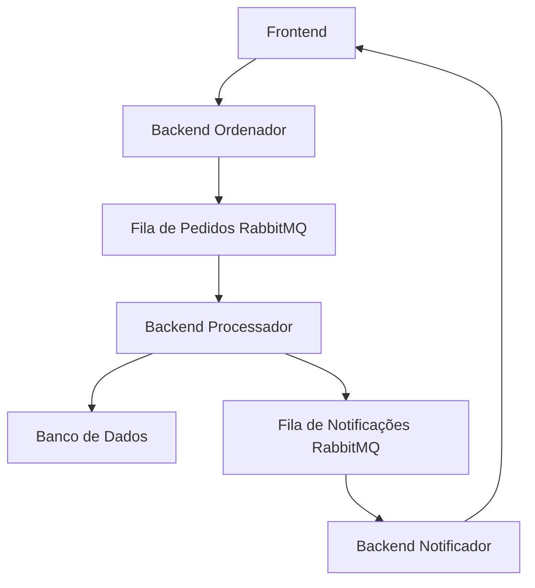

# Messageria - README

## Arquitetura Adotada

A aplicação é composta por múltiplos containers Docker que se comunicam entre si utilizando RabbitMQ para troca de mensagens. A arquitetura é dividida em quatro principais componentes:

1. **Producer**: Um container responsável por receber mensagens externas e enviá-las para uma fila no RabbitMQ.
2. **Processor**: Um container que consome mensagens de uma fila, processa os dados e os salva em um banco de dados.
3. **Notifier**: Um container que consome mensagens de uma fila de notificações e envia notificações via WebSocket para o frontend.
4. **Frontend**: Um container Angular que exibe as notificações em tempo real para os usuários.

### Diagrama da Arquitetura

---

## Descrição da Troca de Mensagens
1. 0 **Frontend** gera uma ordem de produto que manda para o **Ordenador**.
2. O **Ordenador** recebe mensagens do **Frontend** e as envia para a fila de pedidos da **Exchange**.
3. 0 **Exchange** recebe as ordens e coloca na fila de pedidos.
4. O **Processador** consome as mensagens da fila de pedidos e envia uma notificação para a fila de notificações da **Exchange**.
5. O **Notificador** consome mensagens da fila de notificações e utiliza WebSocket para enviar notificações em tempo real ao **Frontend**.
6. O **Frontend** exibe as notificações para os usuários.

---

## Estratégias de Tolerância a Falhas

- **Retries**: Implementação de tentativas automáticas em caso de falha no processamento das mensagens.
- **Persistência**: As mensagens são persistidas no RabbitMQ até serem processadas com sucesso.
- **Logs**: Logs detalhados são gerados em cada container para monitoramento e depuração.
- **Isolamento de Containers**: Cada componente é executado em um container separado, garantindo que falhas em um não afetem os outros.

---

## Tecnologias Utilizadas

- **Docker**: Para orquestração e isolamento dos containers.
- **RabbitMQ**: Para troca de mensagens entre os componentes.
- **PostgreSQL**: Para armazenamento persistente dos dados processados.
- **WebSocket**: Para comunicação em tempo real entre o backend **Notificador** e o **Frontend**.
- **Angular**: Para desenvolvimento do frontend.
- **Java**: A linguagem utilizada nos containers backend.

---

## Como Executar

1. Certifique-se de ter o Docker e o Docker Compose instalados.
2. Clone este repositório.
3. crie um .env como apontado pelo .env.example
4. Execute `docker-compose up -d --build` para iniciar todos os containers.
5. Acesse o frontend no navegador com o ip que você informou no .env ou com localhost:4200 para fazer pedidos visualizar as notificações.

---

